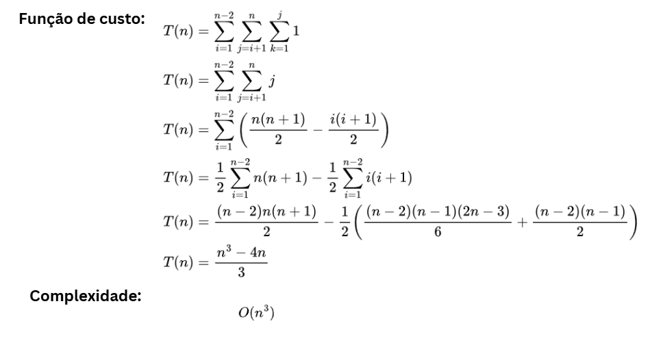
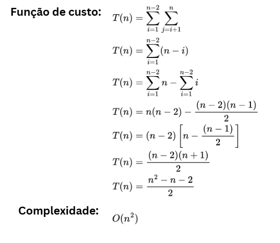
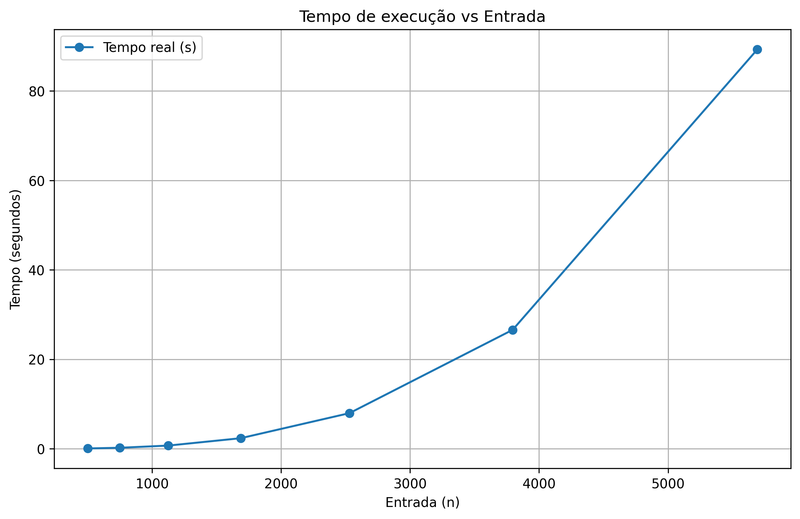
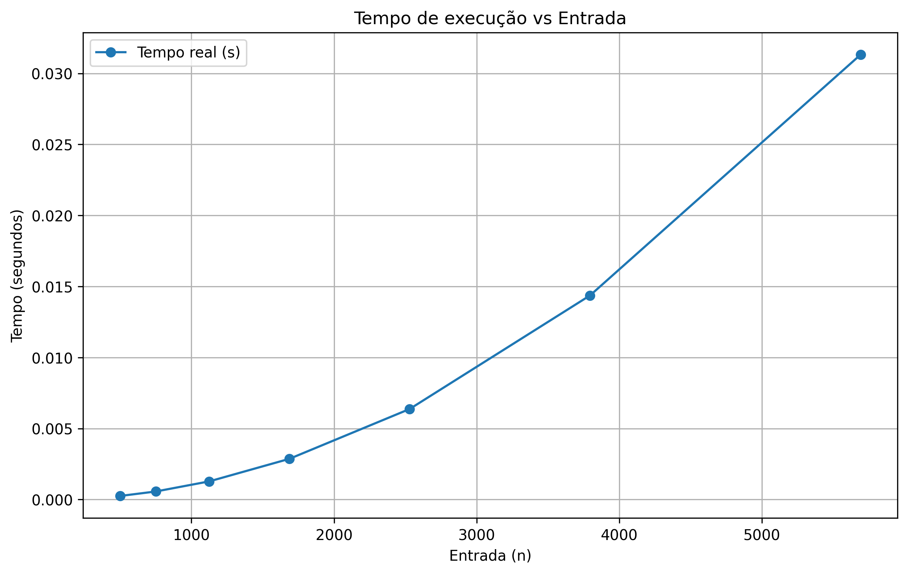
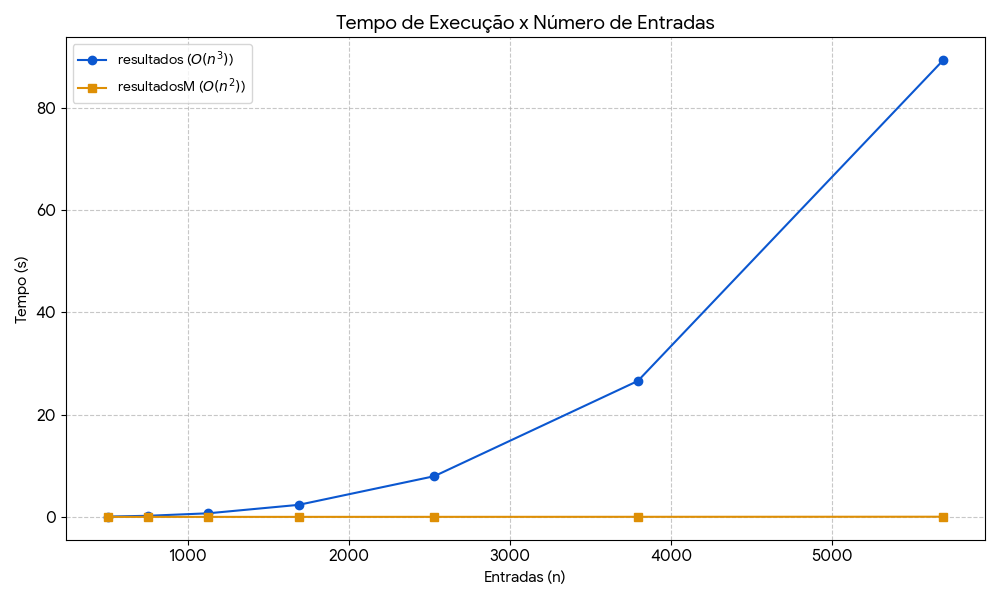

# FazAlgo

## Seminário de Análise de Algoritmos

---

**Integrantes:** [Leonardo Castro](https://github.com/thetwelvedev) e [Álefe Alves](https://github.com/AlefeAlvesC)

**Descrição:**
Este trabalho tem como objetivo analisar a complexidade computacional de um algoritmo denominado FazAlgo, considerando sua função de custo, comportamento assintótico e desempenho prático por meio de experimentação.
Além disso, será proposta uma versão mais eficiente do algoritmo, comparando os resultados obtidos em termos de tempo de execução.

---

## Índice

- [FazAlgo](#fazalgo)
  - [Seminário de Análise de Algoritmos](#seminário-de-análise-de-algoritmos)
  - [Índice](#índice)
  - [Objetivos](#objetivos)
  - [Algoritmo Analisado](#algoritmo-analisado)
  - [Função de Custo e Complexidade](#função-de-custo-e-complexidade)
    - [FazAlgo](#fazalgo-1)
    - [FazMelhor](#fazmelhor)
  - [Experimentação e Resultados](#experimentação-e-resultados)
    - [FazAlgo](#fazalgo-2)
    - [FazMelhor](#fazmelhor-1)
    - [Comparativo FazAlgo x FazMelhor](#comparativo-fazalgo-x-fazmelhor)
  - [Referências](#referências)

---

## Objetivos

* Determinar a função de custo e complexidade do algoritmo
* Implementar o algoritmo em linguagem C
* Experimentar a execução do algoritmo com diferentes entradas e coletar tempos de execução
* Construir gráfico de linha relacionando entrada × tempo de execução
* Analisar a tendência assintótica
* Propor um algoritmo mais eficiente

---

## Algoritmo Analisado

```c
void FazAlgo(int n){

    volatile long soma = 0;

    int i,j,k;

    for(i=1;i<n-1;i++){
        for(j=i+1;j<=n;j++){
            for(k=1;k<=j;k++){

                soma +=1;
            }
        }
    }
}
```

---

## Função de Custo e Complexidade

### FazAlgo


### FazMelhor


---

## Experimentação e Resultados

- Gráfico de linha relacionando entrada × tempo de execução

### FazAlgo


### FazMelhor


### Comparativo FazAlgo x FazMelhor


---

## Referências

* CORMEN, Thomas H. et al. *Algoritmos: teoria e prática*. 3. ed. Rio de Janeiro: Elsevier, 2012.
